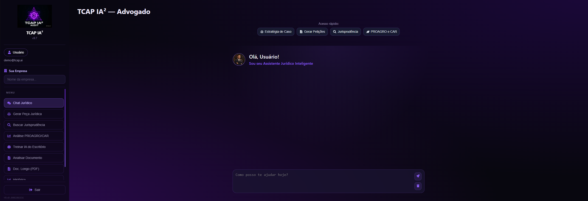

# TCAP IA² — Advogado ⚖️

Uma plataforma web moderna e sofisticada voltada para o setor jurídico, desenvolvida com o objetivo de otimizar a rotina de advogados por meio de inteligência artificial e ferramentas de acesso rápido.

---

## 📸 Demonstração da Interface

Abaixo está uma prévia da tela principal do sistema, destacando o visual premium e a organização dos componentes:

---

## 🚀 Tecnologias Utilizadas

O projeto foi construído utilizando as melhores práticas do ecossistema Front-End atual:

* **React** (Componentização avançada e gerenciamento de estados com Hooks)
* **Vite** (Ambiente de desenvolvimento rápido e bundling otimizado)
* **React Router DOM** (Gerenciamento de rotas SPA dinâmicas e fluidas)
* **React Icons** (Biblioteca de ícones profissionais e otimizados)
* **CSS3 Moderno** (Layout responsivo com suporte a efeitos visuais premium)

---

## 🛠️ Funcionalidades do Sistema

A aplicação conta com um ecossistema completo focado na produtividade jurídica:

* 💬 **Chat Jurídico:** Interface principal de inteligência artificial para consultas e interações em tempo real.
* 🧠 **Estratégia de Caso:** Módulo inteligente para estruturar teses e linhas de defesa.
* 📄 **Gerador de Petições:** Automação e agilidade na criação de peças processuais.
* 🔍 **Busca de Jurisprudência:** Central de pesquisa otimizada para decisões e precedentes.
* 🌱 **PROAGRO e CAR:** Módulo especializado em direito agrário e análise ambiental.
* 📁 **Análise Documental & PDFs Longos:** Componentes preparados para leitura e processamento de arquivos de forma inteligente.
* 👤 **Perfil & Histórico:** Área personalizada do advogado com histórico completo de interações.

---

## 📱 Interface e UX

* **Menu Lateral (Sidebar) Responsivo:** Navegação inteligente adaptada para telas Desktop e Mobile (com acionamento via menu hambúrguer).
* **Dashboard de Acesso Rápido:** Atalhos dinâmicos na home para os módulos mais críticos do sistema, melhorando drasticamente a usabilidade no dia a dia.